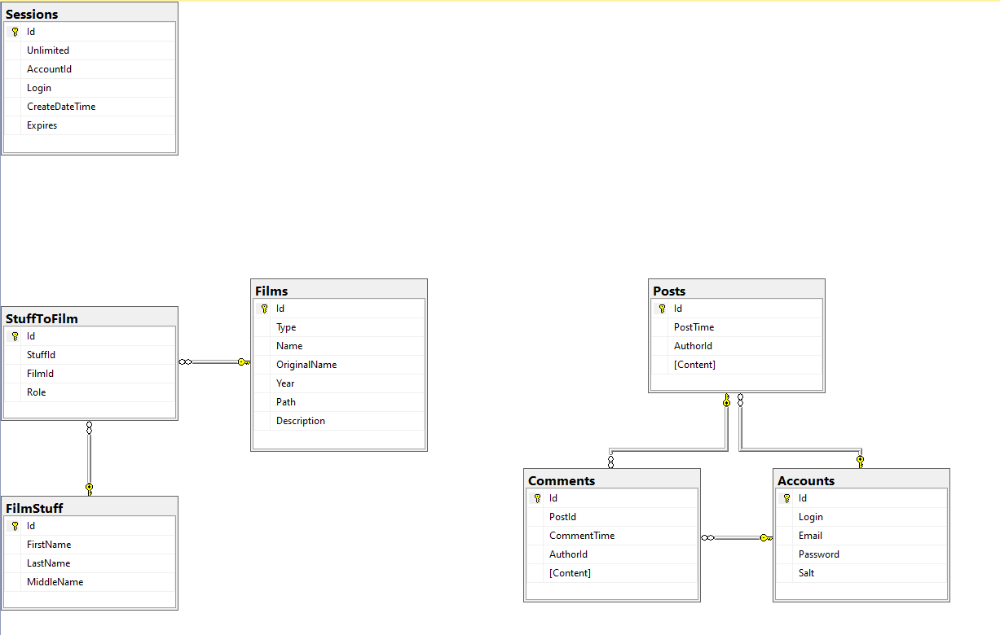

# Тема: Кино

## Перед использованием:

Создайте базу данных MS SQL Server (Параметры сортировки выбрать Cyrilic_General_100_CS_AI), занесите строку подключения в [settings.json](MainFolder/HttpServer2/settings.json)

Выполните все скрипты в папке [DBScripts](DBScripts) в описанном порядке 

Запустите сервер, для перехода на сайт используйте ссылку, которая появится в консоли

## Должна получиться следующая схема таблиц:

## Страницы:
1.	/login => авторизация (форма)
2.	/register => регистрация (форма)
3.	/profile => профиль пользователя (форма)
4.	/ => главная страница
5.	/films => список некоторых фильмов
6.	/films/{id} => конкретный фильм и его описание
7.	/post/{id} => Прсмотр конкретного поста и его комментирование
## БД:
1.	**Accounts**: таблица для хранения пользователей
2.	**Films**: таблица для хранения фильмов/сериалов
3.	**Posts**: таблица для хранения постов пользователей
4.	**Comments**: таблица для хранения комментариев пользователей под постами
5.	**FilmStuff**: таблица для хранения актеров, продюсеров, режисеров и т.д.
6.	**StuffToFilm**: впомогательная таблица для хранения связи между FilmStuff и Films
7.	**SessionId**: таблица для хранения Сессий

